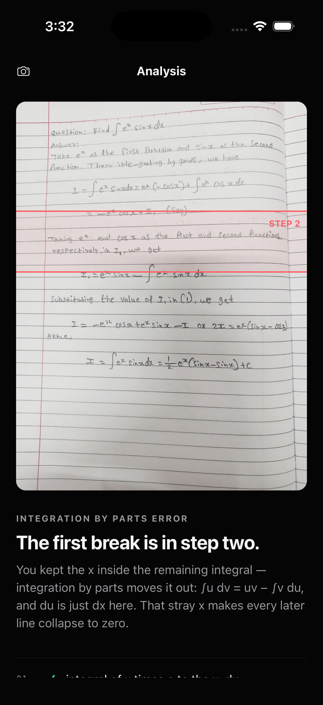
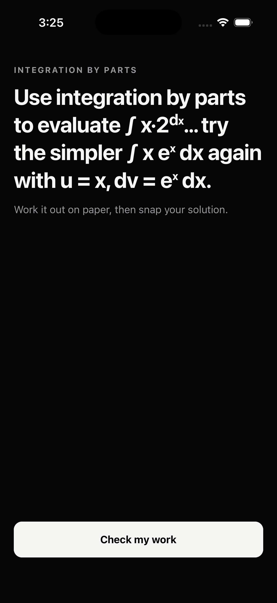
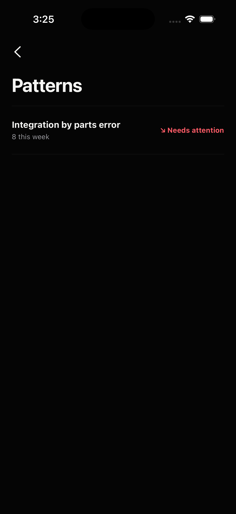

# Snap-a-Mistake

Snap a photo of handwritten algebra/calculus work → AI finds the exact step where the reasoning broke, names the misconception, explains why it broke, and generates an easier follow-up problem. Recurring mistake patterns are tracked locally over time.

<p align="center">
  
  
  
</p>

<p align="center"><sub>Locate the first break · generate targeted practice · track recurring patterns locally</sub></p>

The screens above are captured from the real iOS app. The analysis screen uses
the deterministic mock response so the public UI preview is reproducible; live
GPT-5.6 validation results are reported below.

Built for **OpenAI Build Week** in the **Education** category. The submission
deadline is July 21, 2026 at 5:00 p.m. PDT. The project is evaluated on
technological implementation, coherent product design, potential impact, and
quality of the idea.

## Architecture (three workspaces, npm monorepo)

```
photo → app (Expo/RN) → POST /analyze → server (Fastify, stateless)
  → Stage 1: GPT-5.6-sol vision — transcribe handwriting into indexed steps + y-position bands
  → Stage 2: GPT-5.6-sol text — find FIRST wrong step, tag misconception, explain, follow-up problem
  → Verifier: GPT-5.6-luna — independent audit; disagreement softens "wrong" to "suspect"
  → typed AnalyzeResponse → app renders photo overlay + step cards → history saved to on-device SQLite
```

- **`shared/`** — the API contract: zod schemas (`AnalyzeResponse`, `Step`, `Stage1/2/Verifier` results) and the 13-tag misconception vocabulary. Both server and app import from here; never re-declare these types.
- **`server/`** — Fastify. One route that matters: `POST /analyze` (multipart `photo`) → sharp normalize → 3-stage LLM pipeline → JSON. Stateless by design: no DB, no accounts. All model calls flow through one wrapper (`src/llm/client.ts`: zod-validated JSON with one correction retry; transport errors propagate untouched). Provider swaps only touch this workspace.
- **`app/`** — Expo (expo-router, strict TS). Screens: camera home → analyzing (staged progress) → result (red-band photo overlay + ✓/⚠️/✗/↓ step cards) → follow-up loop → insights (weekly misconception trends). Pure logic lives in `app/src/lib/` (no RN imports — vitest-tested in node); screens are thin components over it. History is device-local SQLite.
- **Parked feature:** an AI video-generation lesson exists in the separate `midnight apps tutor` repo; the Result screen reserves a disabled "🎬 Video lesson — coming soon" slot for it. Deliberately untouched so far.

## Built with Codex and GPT-5.6

Codex was the engineering partner across the project: it helped turn the idea
into reviewed design specs, execute the backend and mobile plans with test-driven
development, curate and provenance-check a real-handwriting regression set, and
run independent task and whole-branch reviews. When paid golden runs exposed
brittle line-number expectations, Codex analyzed sanitized audits and replaced
them with semantic math anchors.

GPT-5.6 powers the product itself. A vision pass transcribes handwriting into
positioned steps, a reasoning pass finds the first broken step and creates
targeted feedback, and an independent verifier softens the UI when the diagnosis
is uncertain.

Key decisions made during that workflow:

- semantic math anchors instead of segmentation-dependent step numbers;
- one exact canonical misconception tag per error;
- a verifier that prefers uncertainty over a false accusation;
- a stateless backend and on-device-only learning history;
- a zero-cost mock path so judges can experience every UI state without keys.

## Where the documentation lives

| What | Where |
|------|-------|
| Approved design spec (source of truth for scope/behavior) | `docs/superpowers/specs/2026-07-17-snap-a-mistake-design.md` |
| Backend implementation plan (executed, complete) | `docs/superpowers/plans/2026-07-17-snap-a-mistake-backend.md` |
| App implementation plan (executed, complete) | `docs/superpowers/plans/2026-07-18-snap-a-mistake-app.md` |
| FERMAT license, citation, and attribution | [`server/golden/FERMAT-ATTRIBUTION.md`](server/golden/FERMAT-ATTRIBUTION.md) |
| FERMAT source records, labels, pinned revision, and shard checksums | [`server/golden/fermat-provenance.json`](server/golden/fermat-provenance.json) |
| Optional FERMAT subset importer (requires accepted FERMAT access and `HF_TOKEN`) | [`server/scripts/import-fermat.py`](server/scripts/import-fermat.py) |

Every task was implemented via fresh-agent TDD with a two-stage review (spec compliance + code quality) and a final whole-branch review per plan.

## Submission kit

The [ready-to-paste Devpost form copy](docs/submission/DEVPOST.md) and [timed
recording plan](docs/submission/DEMO-SCRIPT.md) are prepared for the final
submission.

## Running things

### Judge quickstart — no API key

```bash
npm install
npm run mock -w server
# In a second terminal, use localhost only for an iOS simulator or web target:
cd app && EXPO_PUBLIC_API_URL=http://localhost:3000 npx expo start
```

Press `i` for the iOS simulator or `w` for web. A physical phone must be on the
same network as the Mac and use the Mac's LAN address instead—its `localhost`
points to the phone, not this server:

```bash
cd app && EXPO_PUBLIC_API_URL=http://<Mac-LAN-IP>:3000 npx expo start
```

Use `MOCK=correct npm run mock -w server` or replace `correct` with `error`,
`suspect`, `unreadable`, or `not-math` to exercise every response state.

```bash
npm install                  # root — installs all three workspaces
npm test                     # all workspace Vitest suites + 4 stock-Python importer tests
npm run typecheck            # all workspaces

# Server (needs server/.env — copy server/.env.example, add OPENAI_API_KEY)
npm run dev -w server        # live pipeline on :3000
npm run mock -w server       # NO API key needed — canned fixtures, 4s delay
MOCK=correct npm run mock -w server   # fixtures: correct|error|suspect|unreadable|not-math

# Paid golden regression suite (the gate for ALL prompt tuning — run after any prompt change)
npm run gen-synthetic -w server   # regenerates the 15 synthetic test images
npm run golden -w server          # paid combined 25-case gate; exits 1 on failure
npm run golden:fermat -w server   # paid ten-case handwriting-only gate

# App (device/simulator)
cd app && npx expo start     # Expo Go; phone needs EXPO_PUBLIC_API_URL=http://<Mac-LAN-IP>:3000
```

The root `npm test` command runs both the workspace Vitest suites and the four
stock-`python3` importer regression tests; no third-party Python packages are
needed for the importer tests.

**Conventions that will bite you if you don't know them:** the `app` workspace uses extensionless relative imports (Metro can't resolve `.js`→`.ts`); `server`/`shared` use `.js`-suffixed imports (Node ESM requires them). Model IDs and the legibility threshold live in `server/src/config.ts`. OpenAI JSON mode requires the literal word "JSON" in prompts. Copy strings in the app are tuned demo copy — don't reword casually.

## Current status (as of July 22)

- Backend + app are complete and reviewed. All **148 automated tests** pass, workspace typechecking is clean, and Expo Doctor reports **20/20 checks passed**.
- Physical-device verification is complete on an iPhone development build: camera and gallery input, staged analysis, result overlays, follow-up practice, local Insights, non-math/unreadable responses, and network recovery were exercised. The live pipeline correctly rejected a non-math photo and processed real handwritten math after the long-running request path was hardened.
- Live smoke test passed against the real OpenAI pipeline (~9.5s/analysis).
- Golden manifest: **25 cases** — 15 generated baseline cases plus 10 curated FERMAT photographs (2 correct, 8 intentional errors across algebra/calculus). The generated baseline last passed 15/15. Audited segmentation drift disproved fixed numeric FERMAT indices, so this branch now judges FERMAT localization by semantic anchors and exact canonical tags.
- Latest paid FERMAT validation: **8/10**. Eight real-handwriting cases passed end-to-end; one selected the correct error step but disagreed with the strict canonical tag, and one returned truncated JSON after retry.
- API key: in `server/.env` (git-ignored). The previously exposed key was rotated; keep the replacement out of chats, commits, and demo recordings.

## Steps forward (rough priority order)

1. **Record the public, narrated demo (under three minutes)** using [`docs/submission/DEMO-SCRIPT.md`](docs/submission/DEMO-SCRIPT.md): snap wrong work → locate the first break → explain the misconception → generate an easier follow-up → show recurring patterns. Record the real phone camera for the opening shot, then use device screen recording for legibility.
2. **Upload and verify the video** — make it public or unlisted as the submission rules allow, then open the link in a signed-out browser and confirm the audio, captions, and full playback work.
3. **Complete the submission form** using [`docs/submission/DEVPOST.md`](docs/submission/DEVPOST.md), add the public repository and video links, obtain the required feedback-thread ID, and submit before the deadline.
4. **Deploy only when a future event requires a live endpoint.** Railway is deliberately deferred for this mobile demo: the current judging package is a public repository plus narrated video, and the verified phone workflow can use the Mac-hosted server over the same LAN. A hosted backend can be added later without changing the app architecture.
5. **Optional stretch:** wire the parked video-lesson feature into the reserved Result-screen slot.
6. Deferred code minors: PhotoOverlay `Image.getSize` fallback → migrate to `expo-image`; `history.ts` init-race memoization; 413 status passthrough on oversized uploads; misc polish.

## Things intentionally NOT done

- No auth/accounts/server-side storage (stateless by design — nothing to break in a demo).
- No math-notation renderer in the app (plain-English + monospace LaTeX text was the deliberate YAGNI call).
- Screens/components have no unit tests by design — pure logic is fully tested; UI is verified via the mock-server manual scripts in the app plan's task steps.

## License and data attribution

Original Snap-a-Mistake code is available under the [MIT License](LICENSE).
The curated FERMAT photographs remain under CC BY 4.0; see
[FERMAT attribution](server/golden/FERMAT-ATTRIBUTION.md) and
[provenance](server/golden/fermat-provenance.json). The Expo-derived app
template retains its notice in [app/LICENSE](app/LICENSE).
