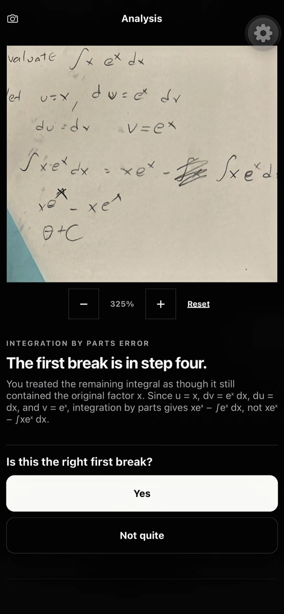
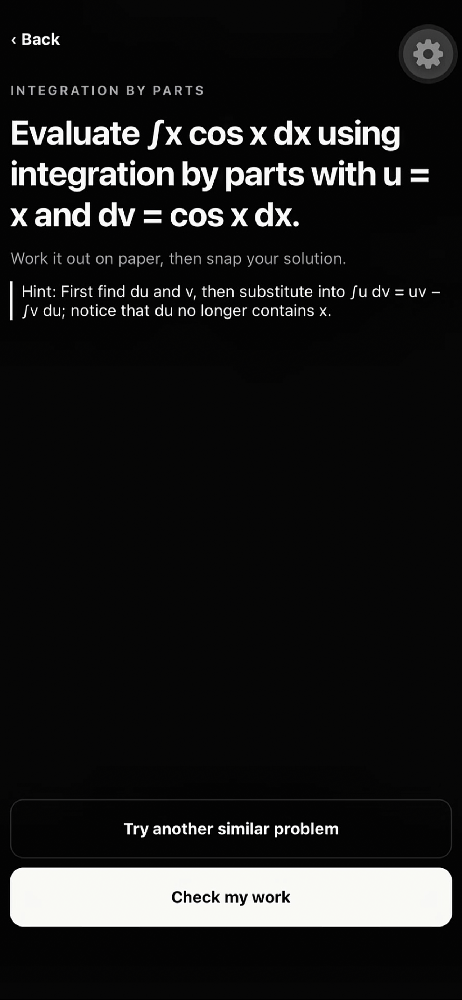
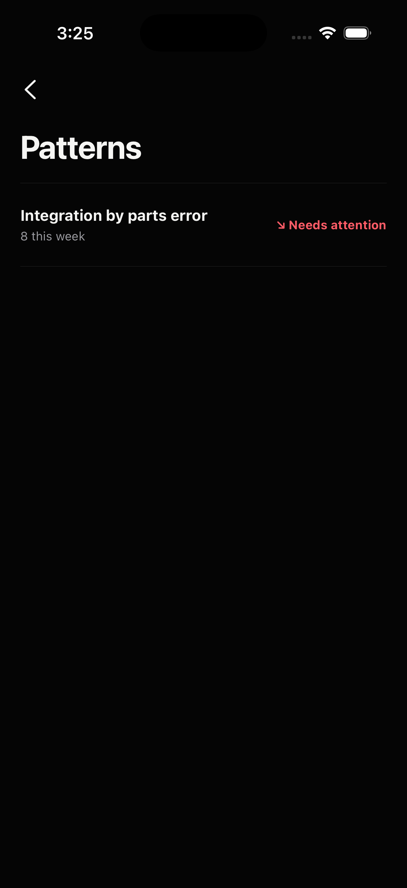

# Snap-a-Mistake

I built Snap-a-Mistake to make handwritten-math feedback more useful than a final-answer check. Take a photo of algebra or calculus work and the app tries to identify the first unsupported step, explain the likely misconception, and offer a similar problem to try next.

The app is an in-progress learning tool, not a guarantee that a model’s diagnosis is right. When independent verification disagrees, it uses a softer “suspect” state instead of presenting the result as certain.

[Demo script](docs/submission/DEMO-SCRIPT.md) · [Devpost copy](docs/submission/DEVPOST.md) · [Project story](docs/submission/PROMETHEUS-ABOUT.md) · [Validation record](docs/validation/2026-07-22-prometheus-readiness.md) · [MIT license](LICENSE)

## See the learning loop

| Find the first break | Try the idea again | See private progress |
| --- | --- | --- |
|  |  |  |
| Keep the original page connected to the diagnosis. | Close the loop with targeted practice. | Review local history without creating an account. |

## What the app does

1. Capture a photo with the camera or choose one from the library, then review, zoom, retake, or replace it.
2. Send the reviewed image to the analysis service for faithful transcription, an image-to-transcript fidelity check, first-break diagnosis, and independent diagnosis verification.
3. Show the page with a linked step timeline and readable Unicode math such as ∫, √, ×, ÷, −, eˣ, and x². Student-facing copy does not render raw LaTeX.
4. Let the student accept, reject, or correct a diagnosis. A correction creates a revision for the same scan; it does not create another Pattern attempt.
5. Offer a similar follow-up problem, optional hint, and alternate similar problem. A checked follow-up remains linked to its parent scan.
6. Show private Patterns and Previous scans, including each scan’s active revision and its retained history.

## Architecture and data flow

```
phone photo
  → Expo / React Native app
  → POST /analyze, /correct-diagnosis, or /follow-up
  → stateless Fastify server
  → configured external AI service
  → shared Zod-validated response
  → photo overlay, step cards, and device-local SQLite history
```

- `shared/` defines the Zod request/response contracts and misconception tags.
- `server/` normalizes a submitted image, verifies that the transcript is supported by visible ink, then runs diagnosis and an independent diagnosis check. Non-math and zero-step transcripts remain absolute rejections. Every nonempty low-confidence transcript reaches the independent fidelity/legibility verifier before strict rejection; the strict path continues only when that verifier confirms it is both faithful and legible. The optional `allowUncertainTranscript=true` flag is a request-scoped override for a student who chooses **Proceed anyway** when the verifier rejects; it may be less accurate and does not weaken the default safeguard for later requests. The server has no accounts, database, or photo/history store.
- `app/` owns reviewed photos in its application document storage and stores scans, revisions, follow-up links, and session recovery state in SQLite on the device. A photo and its scan history remain local until that scan (or Clear all history) is deleted; delete queues the owned photo for safe cleanup. On an unreadable result, **Take a new photo** permanently deletes that unreadable scan and its owned image from device-local Previous scans and Patterns before opening capture.

After a student selects a similar problem, the follow-up problem remains visible until the route is ready and the student makes a fresh **Check my work** activation; the navigation press cannot open capture.

For analysis, the configured external AI service receives the submitted photo. For a diagnosis correction, it receives that photo plus the selected existing analysis context. Follow-up generation sends only the diagnosis, concept, and previous-problem text needed to avoid repetition; it does not send a photo. The server intentionally does not retain those inputs or outputs after responding. This repository does not make claims about the AI provider’s retention practices; review the provider’s applicable terms before using a live service. Use HTTPS for any hosted server.

## Run locally

Install the npm workspaces once:

```bash
npm install
```

### Mock server — deterministic UI and phone checks

Run one terminal:

```bash
MOCK=error npm run mock -w server
```

Then run Expo on a simulator:

```bash
cd app && EXPO_PUBLIC_API_URL=http://localhost:3000 npx expo start --go
```

For a physical phone, use the Mac’s LAN address, not `localhost`:

```bash
cd app && EXPO_PUBLIC_API_URL=http://<MAC-LAN-IP>:3000 npx expo start --go
```

The deterministic modes are `correct`, `error`, `suspect`, `unreadable`, `not-math`, `timeout`, `server-error`, `correction`, and `alternate-follow-up`. Normal content modes wait four seconds. `timeout` waits 181 seconds and ends without an analysis response so the app’s 180-second timeout path is exercised; `server-error` returns a generic server failure. `correction` provides a deterministic corrected diagnosis at `/correct-diagnosis`, and `alternate-follow-up` returns a distinct answer from `/follow-up`. These responses are canned, schema-valid fixtures and contain no raw-LaTeX student-facing text.

### Live server — real-model checks

Create `server/.env` from `server/.env.example`, add `OPENAI_API_KEY`, then run:

```bash
npm run dev -w server
cd app && EXPO_PUBLIC_API_URL=http://<MAC-LAN-IP>:3000 npx expo start --go
```

Live analysis transmits the chosen photo to the configured AI service and may incur API charges. Do not use mock footage as though it were a live result.

## Automated verification

```bash
npm test
npm run typecheck
npm run lint -w app
npm run golden -w server
```

The final automated run on July 28, 2026 completed **567 tests** (42 shared Vitest, 142 server Vitest, 4 stock-Python importer, and 379 app Vitest), all-workspace typechecking, Expo lint, an iOS Expo export to `/tmp/snap-a-mistake-prometheus-final`, and a whitespace check. The exact command results are in the [validation record](docs/validation/2026-07-22-prometheus-readiness.md). `npm run golden -w server` is the paid 25-image live-model gate and requires `OPENAI_API_KEY`; it cannot be treated as a local mock test. Its result is recorded honestly in the validation record.

## Submission and manual verification

The exact pending physical-phone and rehearsal checks, clean mock/live commands, and recording-security checklist are in the [validation record](docs/validation/2026-07-22-prometheus-readiness.md) and [demo script](docs/submission/DEMO-SCRIPT.md). They are intentionally unchecked: they require a physical phone, a live API key for live-model checks, and a human-run rehearsal.

The project story and ready-to-paste submission material are in [PROMETHEUS-ABOUT.md](docs/submission/PROMETHEUS-ABOUT.md) and [DEVPOST.md](docs/submission/DEVPOST.md).

## License and attribution

Original Snap-a-Mistake code is available under the [MIT License](LICENSE). The committed FERMAT handwriting photographs are licensed CC BY 4.0; see the [attribution](server/golden/FERMAT-ATTRIBUTION.md) and [provenance](server/golden/fermat-provenance.json).
